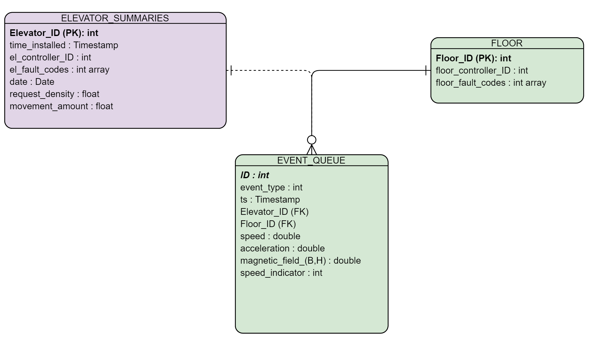

# Mini-Project
## Alari Varmann

## GAME PLAYER ANALYSIS problem

### PROBLEM
*We would like to analyse how far players of a game progress as a function of age. The age is
measured as the number of days since game installation. The progress is measured as a player’s
level number at the end of a day. Note that, in some situations, a player may have to return back
to an earlier level and continue from there. More specifically, we would like to know the average
progress by age for two groups of players
• Those players who actually played the game at a certain age (active players)
• All players including those who happened not to play at a certain age
There are two data sets available to conduct the task
• Installation events with fields: player_id, timestamp
• Level completion events with fields: player_id, timestamp, level_number*

### Solution

First we create the tables from the CSV Files given for both the installation events as well as the level completion events.
~~~sql
create table my_db.public.installation_events
(player_id integer primary key,
 timestamp timestamp
);
-- /home/alari/
copy installation_events from '/tmp/installation_events.csv' with (format csv, header,delimiter ';');

create table my_db.public.level_events
(player_id integer,
 timestamp timestamp,
 level_number integer
);

copy level_events from '/tmp/level_events.csv' with (format csv, header,delimiter ';');
~~~

With exploratory analysis we have confirmed that the amount of players is 10000 and the player progress (levels) vary from 0 to 208 with ages between 0 and 178, so to calculate the average progress per all players, including inactive players, we first create all combinations of players and ages. Many of the values will be NULL since some players didn't complete any levels as others completed only a few,but this way SQL has the full data to calculate the average later on.

~~~sql
CREATE TABLE public.all_comb as (
	WITH myconstants (playeramount, ageamount) as (
   values (10000, 178)
)
SELECT player_id,age FROM myconstants,
GENERATE_SERIES(1,ageamount ) as age,GENERATE_SERIES(1,playeramount ) as player_id
	);
~~~

Next we join the player installation data together with the player level completion data on player ID since this is the unique identifier for the tables. We also calculate the player age as the difference of level completion date and the game installation date, and we express this difference in days, saving this intermediate as intermediate table `result1`.  Doing `count(DISTINCT(player_id)` on this table shows that 7560 players had any completed levels at all while 10000 players had installed the game in total, so 2440 players didn't complete any levels.

~~~sql
CREATE TABLE result1 as (
select DISTINCT m.player_id,level_completed_player_id,age,last_value(level_number) OVER (partition by  player_id,age) as last_level_per_age
from
(select i.player_id as player_id,l.player_id as level_completed_player_id,
DATE_PART('day', date_trunc('day',l.timestamp) - date_trunc('day',i.timestamp)) as age,
l.level_number

from installation_events as i
left join level_events as l
on i.player_id = l.player_id
 )
as m
	)
-- where level_completed_player_id IS NOT NULL
~~~
Table `result1` has 72468 records. Note that all players in the `result1` dataset have non-null player ID, but only those players who completed any levels have non-null `level_completed_player_id`.

Next we merge the player data with their ages and progresses together with all the combinations of possible ages and players, in order to calculate the average over inactive players later. Since there are 10000 players and 178 different ages, the `full` table has 1780000 records.
Left joins are enough in this case to obtain both `result1` and `full` tables since they include all players who installed the game and all combinations of levels they could have obtained.

~~~sql
CREATE TABLE public.full as
(
SELECT a.player_id,
a.age,
r.last_level_per_age
FROM all_comb  as a
LEFT JOIN result1 as r
ON
a.player_id = r.player_id and
a.age = r.age
ORDER BY player_id,age ASC
) ;
~~~


We create a proxy table `final_table` where the `player_true_level` signifies column with complete level information also for these ages where some players were not active.
Next, the idea of the `final_table` is to fill in constant value for player level after the currently known highest progress level as a function of age. This is needed because when we calculate the average over all players, we can assume that when no new levels were completed, the last known level should be used.
~~~sql
CREATE TABLE final_table as (
select player_id,age,first_value(new_level) over (partition by value_partition order by player_id,age) as player_true_level
from (
select 	player_id,age,new_level,
	sum(case when new_level is null then 0 else 1 end) over (order by player_id,age) as value_partition

from (
	select player_id,age,
	CASE WHEN age = 1 and correct_level is null THEN 0 ELSE correct_level END as new_level
from (
SELECT player_id,
age,
 CASE
 WHEN player_id in
 (select player_id from public.full group by 1 having bool_and(public.full.last_level_per_age is null))
 THEN 0
 ELSE  public.full.last_level_per_age  END
 as correct_level,last_level_per_age

FROM public.full
ORDER BY player_id,age
--WINDOW w AS (ORDER BY player_id,age) ) as s
	) as m
	) as t
) as k
)

~~~
OR
~~~sql
CREATE TABLE final_table as (
WITH m as (
SELECT player_id,
age,
 CASE
 WHEN player_id in
 (select player_id from public.full group by 1 having bool_and(public.full.last_level_per_age is null))
 THEN 0
 ELSE  public.full.last_level_per_age  END
 as correct_level,last_level_per_age

FROM public.full
ORDER BY player_id,age
--WINDOW w AS (ORDER BY player_id,age) ) as s
	),
t as (
	select player_id,age,
	CASE WHEN age = 1 and correct_level is null THEN 0 ELSE correct_level END as new_level
from m
	),
k as (
select 	player_id,age,new_level,
	sum(case when new_level is null then 0 else 1 end) over (order by player_id,age) as value_partition
from t
)
select player_id,age,first_value(new_level) over (partition by value_partition order by player_id,age) as player_true_level
from k
)
~~~

The final table contains 1780000 records since it queries from `full` table formed by all combinations of players and ages.


Finally we are ready to obtain the final result. Note that `result1` table has only active player ages present. We do a LEFT join on the age column  since all the ages are present in the `final_table`.
Important : Notice that INNER join will NOT give identical result. The reason behind this is that although inner join correctly drops all the ages that were not present for calculating the average progress for active players, it also drops these ages from all players (where there are no NULL values). Thus, only LEFT join should be used.

~~~sql
CREATE TABLE final_aggregate as (
select ft.age,
AVG(CAST (r.last_level_per_age as Float)) as avg_level_active,
AVG(CAST (ft.player_true_level as Float)) as avg_level_all
from final_table as ft
LEFT join
result1 as r on
ft.age = r.age
group by ft.age);
~~~

Now we will query the data from this table and produce the final plot showing player progress as a function of player age.

(2) We write a Python script that we can call from the Command line terminal in this way:
`python plot_psql_table.py`.

How the script works: The script is run from the `main` method. The `main` method first sets the PostgreSQL database connection parameters and then calls the `fetch_records_from_psql` method with these parameters passed as `kwargs`. We use kwargs since then more parameters can be added in the same dictionary.

Inside the `fetch_records_from_psql` method we first try to connect to the database and in case the connection or fetching data from the table fails, we print out the error message.
Finally after the data has been fetched, we close the database connection.

What could be added : Using `ArgumentParser` to pass arguments from the Command Line.

```Python
#!/usr/bin/env python
# coding: utf-8


import pandas as pd
import psycopg2
import pandas as pd
import seaborn as sns
import matplotlib.pyplot as plt


def fetch_records_from_psql(**connection_parameters):
	user = connection_parameters.get("user")
	password = connection_parameters.get("password")
	host = connection_parameters.get("host")
	database = connection_parameters.get("database")
	port = connection_parameters.get("port")

	try:
		connection = psycopg2.connect(user=user, password=password, host=host, database=database, port=port)
		print("Fetching data with Psycopg2")
		cursor = connection.cursor()
		postgreSQL_select_Query = "select age,avg_level_active,avg_level_all from final_aggregate"

		cursor.execute(postgreSQL_select_Query)
		records = cursor.fetchall()

	except (Exception, psycopg2.Error) as error:
		print("Error while fetching data from PostgreSQL", error)

	finally:
		# closing database connection.
		if (connection):
			cursor.close()
			connection.close()
			print("PostgreSQL connection is closed")
	return records


def main(plot_name="player_progress.png"):
	connection_parameters = {"user": "alari-ThinkPad-P50s",
							 "password": "postgres",
							 "host": "localhost",
							 "port": "5432",
							 "database": "my_db"}
	#get_ipython().run_line_magic('matplotlib', '')
	records = fetch_records_from_psql(**connection_parameters)
	data_to_plot = pd.DataFrame(records, columns=["age", "avg_level_active", "avg_level_all"])
	print(f"The amount of NULL values in the data is {data_to_plot.isnull().sum().sum()}")
	sns_plot = sns.lineplot(x='age', y='value', hue='variable',
							data=pd.melt(data_to_plot, ['age']))
	figure = sns_plot.get_figure()
	figure.savefig(plot_name)


if __name__ == "__main__":
	main()

```

(3) Here is the Image that visualizes how the players progress in the game as a function of player age.


## 2. ELEVATOR SIMULATION PROBLEM

*Let us assume a building has M elevators and N floors and there is a system for simulating
different elevator control mechanisms. You are in charge of measuring the performance of the
control mechanisms and so will need to design the data model to capture observed data and the
measurements you would calculate on that data model. Assume a typical simulation run proceeds
over a 24-hour period and you are allowed to observe as much as you like (when/where each
elevator is, how many passengers, where the passengers are, when/where they arrive/depart, etc.
– if in doubt, assume you can observe it). From your detailed data model, you will then need (with
very simple calculations) to determine various performance measures, for example:
• Average waiting time per passenger
• Average journey time per passenger*
• ... etc
*It will help you succeed in this part of the test if you
• Display your data model in an ERD (Entity Relationship Diagram).
• S how the relevant elements of each element of the data model such as
primary/foreign keys, cardinality between tables (1 to 1, 1 to many, etc) and type of the
fields.
• Explain r eason about your choice of performance measures.
The outcome of the task should include answers to questions:*

*(1) List performance measures that it would be useful or important to measure.*

*(2) What would a suitable data representation look like? Please design a series of tables (as
would be suitable to put in a database or spreadsheet). Make sure that the data representation
(with very simple arithmetic calculations) is adequate to calculate the above measures, and
any other measures that you deem important (and that those calculations are fairly easy and
unambiguous). Please point out any problems you might expect to arise with your data model.*

*(3) For “Average waiting time per passenger” and at least 2 other performance measures,
describe how they can be easily calculated from your data model. Preferably write the SQL
code you would use to calculate the waiting and journey times*

### Solution
(1)
#### Measurable features:
- 1.1 Triggered fault codes from different equipments both for elevators and floors (doors)
- 1.2 Events such as mentioned in the (`Time Calculations` section)
- 1.3 All kind of sensor data (speed,magnetic field, accelerometer data) and operational settings states


#### Derived features
- 2.1 Elevator request density in time (short-time vs longer time), its distribution
- 2.2 Elevator movement amount over time periods, its distribution
- 2.3. 1.3 Can be used to forecast the amount of useful remaining lifetime for each component either in the elevator or floor (doors) (refer to my [previously completed project to find the amount of useful remaining lifecycles in aircraft engines](https://github.com/alarivarmann/Deep_Learning_projects/tree/master/EngineFailurePrediction))
- 2.4 Speed indicator : that BINARY (0 or 1) column indicates whether the elevator is moving at all or not with respect to the building frame of reference (0 indicates the elevator is standing still, 1 indicates that the elevator is moving)

Motivated by this, the ERD Table can be something like this


We assume the elevators work from 6 to 23:59 and not between 00:00 and 5:59.
It works this way that the `EVENT_QUEUE` is a streaming-database such as Amazon Kinesis Firehose. It stores live streaming data at regular intervals (say every 5 seconds). Then there is a (AWS Glue) ETL Summary Process that produces Summaries per each day and stores them in a table (e.g. in AWS Glue Metadata Catalogue from where we could use Amazon Athena or Amazon Redshift Spectrum to query this table).
There could be multiple versions of elevator summaries -- storing daily, 3h and 6h summaries for each elevator.
For every elevator, we would keep track of what is its controller equipment version (`el_controller_ID`) and when it was installed; also we have the dates and for each date or time period, we store the **request density (or amount**), (density refers to time density) and **movement_amount** for active working time. The request density is defined as the amount of customer elevator requests per chosen summarization time period for each elevator and the movement_amount is the amount of events where the speed is non-zero (alternative is to compute time-wise coverage, but we assume a constant time-grid size, e.g. 5 seconds as mentioned before).


#### Computing Statistics and Features : Methodology

The solution design is such that we use either a 360-degree camera to detect single passengers moving on and off the elevators combined with Mask-RCNN based instance segmentation and detection [Mask-RCNN source article](https://arxiv.org/abs/1703.06870) to track every person embarking and departing from the elevator, if needed. If the detection performance is good enough without the Mask-RCNN, then we use just the 360-degree camera.

**Assumptions for our conceptual approach:**

(1) If all the elevators are managed similarly by the controller system, then the average (functions, since the process can be considered stochastic) of amount of trips per each elevator over a sufficiently long enough time period should be on the same order of magnitude.

(2) We don't know whether our fault code logic works well enough and we would want to validate movement-related anomalies. Let's assume the logic is the same for each controller but that we can test different controllers against each other.

**Why  assumption (1) is not always met**:

Due to stochastic nature of customer incoming requests, in some realizations, the amount of elevator trips in  a given time period can be 0, especially when the chosen time period is short.

##### Ideal Performance Tracking System
Ideally there would be fault codes that indicate whether the elevator is dysfunctional in a certain way -- then the respective `el_fault_codes` would be logged to the `elevator_summaries` table.
Assume that when fault codes triggered, then the respective elevator component for that elevator will be fixed as indicated by the entries in the `elevator_summaries` table.


**How to validate movement-related anomalies or faults?**

#### Double Validation or Debugging of Movement Related Faults/anomalies

We compute the **elevator request density (amount)** and **movement_amount** metrics (in a certain time period) because we assume there is a core algorithm that computes which elevator should be sent given a customer order query. When debugging if the systems works well, one should first know the amount of incoming requests per time period and then observe how these requests are distributed among elevators. Assuming that the algorithm works decently, then in the long run, the elevators should get a similar amount (at least on the order of magnitude) of incoming queries (we assume this since a company should try to make the maximal use of its assets, which are elevators, and not overload some elevators that would then need much more frequent fixing or replacement).

##### Why We Compute elevator request density and movement_amount

Given these two metrics, one can then compute the Pearson cross-correlation between the elevator `request_amount` and `movement_amount` since the more incoming requests an elevator gets, the more it should move relative to standstill (that implies moderate to strong positive correlation). Cases of interest would then be for example moderately or strongly negative Pearson cross-correlation coefficient values -- that indicates that on average, given a high rate of incoming requests, the elevator moves relatively little and vice versa, given a low amount of queries, the elevator gets triggered more than optimal. It is relevant because if the logic triggers some elevators more often, the company has cumulatively higher costs because of higher maintenance needs, but if the elevator is triggered less than optimal, then other elevators will be more overloaded than in the optimal scenario.


#### Practical Possible Use Case -- Elevator Efficiency Estimation
Correlation is a mathematical concept and in business situations, reaction time to events, for example elevator equipment fault codes is equivalently important, that is when finding anomalies, shorter time periods should be analyzed first because that enables the anomalies to be detected faster.

It is a known fact that often when a person orders an elevator, one of M elevators will come (*group elevators*). Thus it might happen that there exists an elevator that is dispatched very seldom.

**How to find a "Dormant" Elevator**

To  find such a dormant elevator, we could:

(1) Calculate the the movement amount in different time periods and compare it to the request density for that time period, i.e. compute the ratio of sum of incoming customer elevator requests to the amount of movements events, let's call it  **metric1**, for each of the time-period for each elevator, first for 3 hours, then 6 hours, then 1 working day.

(2) Calculate  the median of this distribution of **metric1** over all elevators. We will then compare whether a particular instance of some elevator **metric1** value in that time period is at least 10x higher or lower (dependent on what kind of anomaly is sought for) than the median of the **metric1** distribution over all elevators . In case it is, that could possibly be an anomaly with either the sensor sensitivity, function or the trigger logic of the elevator, for example if a controller signals wrong  movement direction or whether the elevator is moving at all, and thus the elevator is triggered more or less often.  If the anomaly is present,  this elevator and controller version should by investigated by a technician.

 If the algorithm triggers too often and the elevators were in fact reported to be fine by the technicians, then the triggering threshold value should be increased. We can write an optimization routine that finds the optimal threshold triggering value where the amount of expenditure is the smallest (i.e. the algorithm finds the anomalous elevators without spending a lot of technician time due to false positives.)

 In the example below, we give a SQL query to find elevators that are triggered too often (subsection Finding elevators that are triggered too much). Similarly, we can also find dormant elevators.


#### Time Calculations : Collected Data


We assume an implemented sensor cloud where the passenger data is shared so that all the relevant events are stored in the EVENT_QUEUE table.
The table stores the following fields:
`ID` :int-- **Primary Key** -- quantifies the record number in the tables
`event_type` : int with the following denomination:


Due to our computer vision based tracking system, we can track every single person going and leaving on the elevator.
We track only the relevant events per each passenger.
- `event_type`=1 -- passenger orders the elevator with ID (`elevator_id`) to floor Y
- `event_type`=2 -- elevator (`elevator_id`) has arrived at the requested floor for passenger Z (not logged explicitly)
- `event_type`=3 -- the elevator (`elevator_id`)  has arrived at the **final** destination for passenger K (not logged explicitly). By final we mean that a group of passengers may stop at multiple stops, but the event saved is for the person who exits the elevator.
- 4 - Elevator ( with `elevator_id`) stopped ((instataneous) speed  = 0)
- 5 - Elevator ( with `elevator_id`) moving ((instataneous) speed = 0)


Thus, to find the average waiting time per person, we will just have to take the average of the respective time durations. We will show here an example query to find the average journey time per elevator :

~~~sql
SELECT elevator_id,AVG(dt)
FROM (
SELECT
CASE WHEN lag(elevator_id) OVER (ORDER BY elevator_id,ts)  < elevator_id THEN NULL
ELSE ts - lag(ts) OVER (ORDER BY elevator_id,ts)  END as dt
,
CASE
WHEN event_type = 2 THEN 'waiting_time'
WHEN event_type = 3 THEN 'journey_time' END as time_type
from EVENT_QUEUE
)as base
where time_type = 'journey_time'
GROUP BY elevator_id
~~~

Finding the global average passenger journey time over all elevators can be done in the following way:

~~~sql
SELECT AVG(dt)
FROM (
SELECT
CASE
WHEN lag(elevator_id) OVER (ORDER BY elevator_id,ts)  < elevator_id THEN NULL
ELSE ts - lag(ts) OVER (ORDER BY elevator_id,ts)  END as dt
,
CASE WHEN event_type = 2 THEN 'waiting_time'
WHEN event_type = 3 THEN 'journey_time' END as time_type
from EVENT_QUEUE
)as base
where time_type = 'journey_time'
~~~

Finding the global average passenger waiting time over all elevators can be done in the following way:


~~~sql
SELECT AVG(dt)
FROM (
SELECT
CASE
WHEN lag(elevator_id) OVER (ORDER BY elevator_id,ts)  < elevator_id THEN NULL
ELSE ts - lag(ts) OVER (ORDER BY elevator_id,ts)  END as dt
,
CASE WHEN event_type = 2 THEN 'waiting_time'
WHEN event_type = 3 THEN 'journey_time' END as time_type
from EVENT_QUEUE
)as base
where time_type = 'waiting_time'--
~~~

#### Finding elevators that Take Maybe Too Many Trips

To find these elevators, we can find how many trips the elevator has taken using the `speed_indicator` column. Since for every movement, the speed changes two times (at the beginning and at the end), we count the amount of `speed_indicator` changes subtract 1 (for end point purposes) and divide by 2 since the amount of actual trips is twice less. If we just summed all the values where the `speed_indicator` = 1, then we would put more weight on longer trips and in case we had a skyscraper, this would be a significant factor in this analysis. That is why we use the gradient (or speed changes) instead.

The comments explain how elevator movements are related to the gradient of speed change. 0 denotes a movement and --- denotes that the elevator is standing still.
~~~sql

 ---0---0--0---- (2n registrations for n movements, so in general sum over 2 is amount of movements)
 -- When using lag, we can use (n-1)/2 as the amount of movements where n is the amount of movement changes
 -- Have to subtract 1 because lag indicates also the changes from the 0th non-existing record


  ---0---0--0---- (2n registrations for n movements, so in general sum over 2 is amount of movements)
  -- When using lag, we can use (n-1)/2 as the amount of movements where n is the amount of movement changes
  -- Have to subtract 1 because lag indicates also the changes from the 0th non-existing record

 WITH basedata as (
 		 SELECT elevator_id,ts, speed_indicator,EXTRACT(hour from ts) as event_hour,
           -- assigns 1 whenever speed_indicator changes
           case when lag(speed_indicator) over (order by ts) = speed_indicator
                then 0 -- when the previous value coincides with the current value
                else 1 -- when the previous and current value don't coincide
           end as gradient
        from EVENT_QUEUE
     ),
 	-- movements_per_elevator outputs amount of movements as defined by changes in in the velocity state for each elevator
 	movements_per_elevator as
 	(select elevator_id,EXTRACT(hour from ts) as hour_,(sum(gradient)-1)/2 as movements
     from
   	basedata
 	group by elevator_id,hour_)
 	,
 	top_elevators as
 	(select elevator_id,hour_ from movements_per_elevator where movements >  10*percentile_cont(0.5) within group (order by movements desc ) over (partition by hour_))

 	select movements_per_elevator.elevator_id,hour_,movements as total_movements -- elevator_speed_counter
 	from
 	movements_per_elevator
 	where movements_per_elevator.elevator_id in (select elevator_id from top_elevators) and movements_per_elevator.hour_ in (select hour_ from top_elevators)
~~~

We can then find the **metric1** by dividing the amount of requests by the amount of movements for these elevators.
To do that, we can sum up the amount of events per elevator per time period (We can query the amount of requests for an elevator  from `EVENT_QUEUE` table, filtering `event_type`=1).

From the viewpoint of this query, we can check if any of these elevators that were filtered above for these hours are also included in the elevators of interest by the amount of requests, namely those elevators that have e.g. relatively low amount of incoming requests over all elevators for these hours.

It would be more clear to do the median-based filtering after the **metric1** has been calculated though because maybe the amount of movements did not increase so much, but the amount of incoming elevator requests decreased 20-fold for a given elevator for a given time period.

### Other Types of Possible Analyses

We could also analyze all types of different faults that are generated using different elevator equipment (controller) types and then do cost-discovery analyses for them -- rank the faults by their level of cost for the company and then tweak the algorithms to find the highest costing faults firsthand, and then other faults that perhaps induce a lesser cost to the company. Machine learning can be used here as well.

We could also do analyses on floor levels, e.g. analyze which floors have the most frequent fault code triggerings (from doors). One floor can have multiple elevators at a time and one elevator can only be at 0 or one floor at a time as indicated in our ERD diagram.

All other sensor (magnetic field, location, accelerometer data etc) measurements can be used to predict amount of useful life in any elevator or other equipment component using machine learning (deep learning methods that work on time series data) as referred to before.

### Analysis of the Data Model:

Advantages : Handles both live data (`event_queue`) as well as aggregate data (`elevator_summaries`).

Drawback :
(1) The lag based calculations for the average times assumes that there are no missing or inconsistent recordings in the data. If this was the case, then a more complex filter and group by approach would be the right one.
