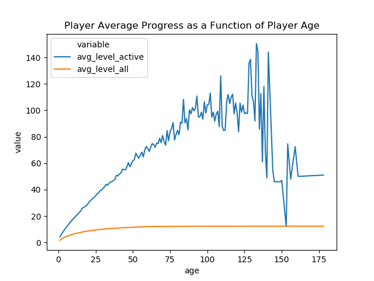
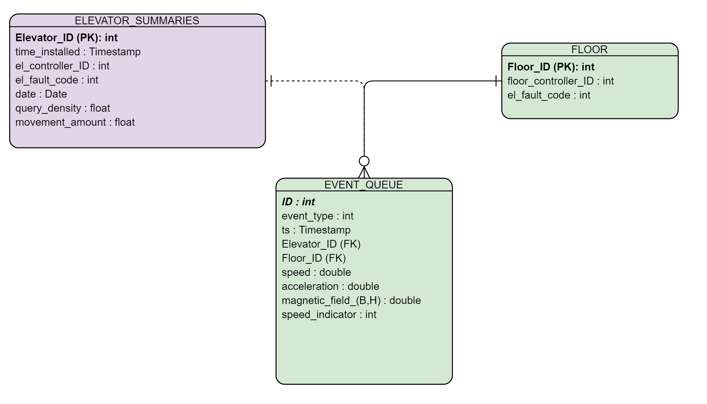

# Seriously Data Analyst Problem Set Solution
## Alari Varmann

## GAME PLAYER ANALYSIS problem

We would like to analyse how far players of a game progress as a function of age. The age is
measured as the number of days since game installation. The progress is measured as a player’s
level number at the end of a day. Note that, in some situations, a player may have to return back
to an earlier level and continue from there. More specifically, we would like to know the average
progress by age for two groups of players
• Those players who actually played the game at a certain age (active players)
• All players including those who happened not to play at a certain age
There are two data sets available to conduct the task
• Installation events with fields: player_id, timestamp
• Level completion events with fields: player_id, timestamp, level_number
The outcome of the task should include
(1) An SQL script with queries that calculate the average progress by age and insert the results
into a table with fields: age, avg_level_active, avg_level_all
(2) An R or Python script that reads data from the results table, plots a chart with the two
progress curves and saves the chart as an image file
(3) The image file

### Solution

(1)
~~~sql
create table public.all_comb as (
	WITH myconstants (playeramount, ageamount) as (
   values (10000, 208)
)
SELECT player_id,age FROM myconstants,
GENERATE_SERIES(1,ageamount ) as age,GENERATE_SERIES(1,playeramount ) as player_id
	);

CREATE TABLE result1 as (
select DISTINCT player_id,age,last_value(level_number) OVER (partition by  player_id,age) as last_level_per_age
from
(select i.player_id as player_id,
DATE_PART('day', date_trunc('day',l.timestamp) - date_trunc('day',i.timestamp)) as age,
l.level_number
--AVG(l.level_number) as avg_level_all
from installation_events as i
inner join level_events as l
on i.player_id = l.player_id
 )
as m
);
~~~


~~~sql

CREATE TABLE final_table as (
select player_id,age,first_value(new_level) over (partition by value_partition order by player_id,age) as player_true_level
from (
select 	player_id,age,new_level,
	sum(case when new_level is null then 0 else 1 end) over (order by player_id,age) as value_partition

from (
	select player_id,age,
	CASE WHEN age = 1 and correct_level is null THEN 0 ELSE correct_level END as new_level
from (
SELECT player_id,
age,
 CASE
 WHEN player_id in
 (select player_id from public.full group by 1 having bool_and(public.full.last_level_per_age is null))
 THEN 0
 ELSE  public.full.last_level_per_age  END
 as correct_level,last_level_per_age

FROM public.full
ORDER BY player_id,age
--WINDOW w AS (ORDER BY player_id,age) ) as s
	) as m
	) as t
) as k
)

~~~
OR
~~~sql
WITH m as (
SELECT player_id,
age,
 CASE
 WHEN player_id in
 (select player_id from public.full group by 1 having bool_and(public.full.last_level_per_age is null))
 THEN 0
 ELSE  public.full.last_level_per_age  END
 as correct_level,last_level_per_age

FROM public.full
ORDER BY player_id,age
--WINDOW w AS (ORDER BY player_id,age) ) as s
	),
t as (
	select player_id,age,
	CASE WHEN age = 1 and correct_level is null THEN 0 ELSE correct_level END as new_level
from m
	),
k as (
select 	player_id,age,new_level,
	sum(case when new_level is null then 0 else 1 end) over (order by player_id,age) as value_partition
from t
)

CREATE TABLE final_table as (
select player_id,age,first_value(new_level) over (partition by value_partition order by player_id,age) as player_true_level
from k
)
~~~

~~~sql
CREATE TABLE final_aggregate as (
select ft.age,
AVG(CAST (r.last_level_per_age as Float)) as avg_level_active,
AVG(CAST (ft.player_true_level as Float)) as avg_level_all
from final_table as ft left join
result1 as r on
ft.age = r.age
group by ft.age);
~~~

(2)
```Python
#!/usr/bin/env python
# coding: utf-8


import pandas as pd
import psycopg2
import pandas as pd
import seaborn as sns
import matplotlib.pyplot as plt


def fetch_records_from_psql(**connection_parameters):
	user = connection_parameters.get("user")
	password = connection_parameters.get("password")
	host = connection_parameters.get("host")
	database = connection_parameters.get("database")
	port = connection_parameters.get("port")

	try:
		connection = psycopg2.connect(user=user, password=password, host=host, database=database, port=port)
		print("Fetching data with Psycopg2")
		cursor = connection.cursor()
		postgreSQL_select_Query = "select age,avg_level_active,avg_level_all from final_aggregate"

		cursor.execute(postgreSQL_select_Query)
		records = cursor.fetchall()

	except (Exception, psycopg2.Error) as error:
		print("Error while fetching data from PostgreSQL", error)

	finally:
		# closing database connection.
		if (connection):
			cursor.close()
			connection.close()
			print("PostgreSQL connection is closed")
	return records


def main(plot_name="player_progress.png"):
	connection_parameters = {"user": "alari-ThinkPad-P50s",
							 "password": "postgres",
							 "host": "localhost",
							 "port": "5432",
							 "database": "my_db"}
	#get_ipython().run_line_magic('matplotlib', '')
	records = fetch_records_from_psql(**connection_parameters)
	data_to_plot = pd.DataFrame(records, columns=["age", "avg_level_active", "avg_level_all"])
	print(f"The amount of NULL values in the data is {data_to_plot.isnull().sum().sum()}")
	sns_plot = sns.lineplot(x='age', y='value', hue='variable',
							data=pd.melt(data_to_plot, ['age']))
	figure = sns_plot.get_figure()
	figure.savefig(plot_name)


if __name__ == "__main__":
	main()

```

(3)



## 2. ELEVATOR SIMULATION PROBLEM

The outcome of the task should include answers to questions
(1) List performance measures that it would be useful or important to measure.

(2) What would a suitable data representation look like? Please design a series of tables (as
would be suitable to put in a database or spreadsheet). Make sure that the data representation
(with very simple arithmetic calculations) is adequate to calculate the above measures, and
any other measures that you deem important (and that those calculations are fairly easy and
unambiguous). Please point out any problems you might expect to arise with your data model.

(3) For “Average waiting time per passenger” and at least 2 other performance measures,
describe how they can be easily calculated from your data model. Preferably write the SQL
code you would use to calculate the waiting and journey times

### Solution
(1)
#### Measurable features:
- 1.1 Triggered fault codes from different equipments both for elevators and floors (doors)
- 1.2 Events such as mentioned in the (`Time Calculations` section)
- 1.3 All kind of sensor data (speed,magnetic field, accelerometer data) and operational settings states
- 1.4 Speed indicator : that column indicates whether the elevator is moving or not with respect to the building frame of reference.

#### Derived features
- 2.1 Elevator query density in time (short-time vs longer time), its distribution
- 2.2 Elevator movement amount over time periods, its distribution
- 2.3. 1.3 Can be used to forecast the amount of useful remaining lifetime for each component either in the elevator or floor (doors) (refer to my [previously completed project to find the amount of useful remaining lifecycles in aircraft engines](https://github.com/alarivarmann/Deep_Learning_projects/tree/master/EngineFailurePrediction))

Motivated by this, the ERD Table can be something like this


We assume the elevators work from 6 to 23:59 and not between 00:00 and 5:59.
It works this way that the `EVENT_QUEUE` is a streaming-database such as Amazon Kinesis Firehose. It stores live streaming data at regular intervals (say every 5 seconds). Then there is a (AWS Glue) ETL Summary Process that produces Summaries per each day and stores them in a table (e.g. in AWS Glue Metadata Catalogue from where we could use Amazon Athena or Amazon Redshift Spectrum to query this table).
There could be multiple versions of elevator summaries -- storing daily, 3h and 6h summaries for each elevator.
For every elevator, we would keep track of what is its controller equipment version (`el_controller_ID`) and when it was installed; also we have the dates and for each date or time period, we store the **query density** and **movement_amount** for active working time. The query density is defined as the amount of customer elevator requests per day for each elevator and the movement_amount is the amount of events where the speed is non-zero (alternative is to compute time-wise coverage, but we assume a constant time-grid size).


#### Computing Statistics and Features : Methodology

The solution design is such that we use Mask-RCNN based instance segmentation and detection [Mask-RCNN source article](https://arxiv.org/abs/1703.06870) to track every person embarking and departing from the elevator.

Approach 1: if no elevator has fundamentally different logic, then the standstill rates should be on the same order of magnitude, but due to stochastic nature of customer incoming requests, it can be 0 some days especially if the incoming request density is very low.
Ideally there would be fault codes that indicate whether the elevator is dysfunctional in a certain way -- then the respective `el_fault_code` would be logged to the `elevator_summaries` table.
Assume that when fault codes triggered, then the respective elevator component for that elevator will be fixed as indicated by the entries in the `elevator_summaries` table.

But we can also assume that we don't know whether our fault code logic works well enough and we would want to validate movement-related anomalies. Let's assume the logic is the same for each controller but that we can test different controllers against each other.

**How to validate movement-related anomalies or faults?**

#### Double Validation or Debugging of Movement Related Faults/anomalies

We compute the **query density** and **movement_amount** metrics because we assume there is a core algorithm that computes which elevator should be sent given a customer order query. When debugging if the systems works well, one should first know the amount of incoming requests per time period and then observe how these requests are distributed among elevators. Assuming that the algorithm works decently, then in the long run, the elevators should get a similar amount (at least on the order of magnitude) of incoming queries (we assume this since a company should try to make the maximal use of its assets, which are elevators, and not overload some elevators that would then need much more frequent fixing or replacement).
From this table, one can then compute the Pearson cross-correlation between the query density and `movement_amount` since the more queries an elevator gets, the more it should move relative to standstill (that implies moderate to strong positive correlation). Cases of interest would then be for example weak or negative Pearson cross-correlation coefficient values -- that indicates that on average, given a high rate of incoming queries, the elevator moves relatively little and vice versa, given a low amount of queries, the elevator gets triggered more than optimal. It is relevant because if the logic triggers some elevators more often, the company has cumulatively higher costs because of higher maintenance needs, but if the elevator is triggered less than optimal, then other elevators will be more overloaded than optimal.


#### Practical Possible Use Case -- Elevator Efficiency Estimation
Correlation is a mathematical concept and in business situations, reaction time is important as well.
It is a known fact that often when a person orders an elevator, one of M elevators will come (*group elevators*). Thus it might happen that if any of M elevators can come, 1 elevator rarely is dispatched. For example find such an elevator, we will calculate the the movement amount for different periods and compare it to the query density for that time period.
 This is why in real life, we could compute the ratio of sum of incoming customer elevator requests to the amount of movements events, called in metric1, for each of the time-period for each elevator, first for 3 hours, then 6 hours, then 1 working day and then we compute the median of this distribution of metric1 over all elevators. We then compare whether a particular elevator metric 1 value is at least 10x higher than the median of the metric 1 distribution over all elevators . In case it is, that could possibly be an anomaly with either the sensor sensitivity, function or the trigger logic of the elevator, for example if a controller signals wrong  movement direction or movement and thus the elevator is triggered more or less often.  If the anomaly is present,  this elevator and controller version should by investigated by a technician.

 If the algorithm triggers too often and the elevators were in fact reported to be fine by the technicians, then the triggering threshold value should be increased. We can write an optimization routine that finds the optimal threshold triggering value where the amount of expenditure is the smallest (i.e. the algorithm finds the anomalous elevators without spending a lot of technician time due to false positives.)


#### Time Calculations : Collected Data


We assume an implemented sensor cloud where the passenger data is shared so that all the relevant events are stored in the EVENT_QUEUE table.
The table stores the following fields:
`ID` :bigint-- Primary Key -- quantifies the record number in the tables
`event_id` : bigint with the following denomination:


Due to our computer vision based tracking system, we can track every single person going and leaving on the elevator.
We track only the relevant events per each passenger.
- `event_id`=1 -- passenger orders the elevator with ID (`elevator_id`) to floor Y
- `event_id`=2 -- elevator (`elevator_id`) has arrived at the requested floor for passenger Z (not logged explicitly)
- `event_id`=3 -- the elevator (`elevator_id`)  has arrived at the **final** destination for passenger K (not logged explicitly). By final we mean that a group of passengers may stop at multiple stops, but the event saved is for the person who exits the elevator.
- 4 - Elevator ( with `elevator_id`) stopped ((instataneous) speed  = 0)
- 5 - Elevator ( with `elevator_id`) moving ((instataneous) speed = 0)


Thus, to find the average waiting time per person, we will just have to take the average of the respective time durations. We will show here an example query to find the average journey time per elevator :

~~~sql
SELECT elevator_id,AVG(dt)
FROM (
SELECT
CASE WHEN lag(elevator_id) OVER (ORDER BY elevator_id,ts)  < elevator_id THEN NULL
ELSE ts - lag(ts) OVER (ORDER BY elevator_id,ts)  END as dt
,
CASE
WHEN event_type = 2 THEN 'waiting_time'
WHEN event_type = 3 THEN 'journey_time' END as time_type
from EVENT_QUEUE
)as base
where time_type = 'journey_time'
GROUP BY elevator_id
~~~

Finding the global average passenger journey time over all elevators can be done in the following way:

~~~sql
SELECT AVG(dt)
FROM (
SELECT
CASE
WHEN lag(elevator_id) OVER (ORDER BY elevator_id,ts)  < elevator_id THEN NULL
ELSE ts - lag(ts) OVER (ORDER BY elevator_id,ts)  END as dt
,
CASE WHEN event_type = 2 THEN 'waiting_time'
WHEN event_type = 3 THEN 'journey_time' END as time_type
from EVENT_QUEUE
)as base
where time_type = 'journey_time'
~~~

Finding the global average passenger waiting time over all elevators can be done in the following way:


~~~sql
SELECT AVG(dt)
FROM (
SELECT
CASE
WHEN lag(elevator_id) OVER (ORDER BY elevator_id,ts)  < elevator_id THEN NULL
ELSE ts - lag(ts) OVER (ORDER BY elevator_id,ts)  END as dt
,
CASE WHEN event_type = 2 THEN 'waiting_time'
WHEN event_type = 3 THEN 'journey_time' END as time_type
from EVENT_QUEUE
)as base
where time_type = 'waiting_time'--
~~~

#### Finding elevators that are triggered too much

To find these elevators, we can find how many trips the elevator has taken using the `speed_indicator` column. Since for every movement, the speed changes two times (at the beginning and at the end), we count the amount of `speed_indicator` changes subtract 1 (for end point purposes) and divide by 2 since the amount of actual trips is twice less. If we just summed all the values where the `speed_indicator` = 1, then we would put more weight on longer trips and in case we had a skyscraper, this would be a significant factor in this analysis. That is why we use the gradient (or speed changes) instead.

~~~sql

 ---0---0--0---- (2n registrations for n movements, so in general sum over 2 is amount of movements)
 -- When using lag, we can use (n-1)/2 as the amount of movements where n is the amount of movement changes
 -- Have to subtract 1 because lag indicates also the changes from the 0th non-existing record

WITH basedata as (
		 SELECT elevator_id,ts, speed_indicator,EXTRACT(hour from ts) as event_hour,
          -- assigns 1 whenever speed_indicator changes
          case when lag(speed_indicator) over (order by ts) = speed_indicator
               then 0 -- when the previous value coindices with the current value
               else 1 -- when the previous and current value don't coincide
          end as gradient
       from EVENT_QUEUE
    ),
	-- movements_per_elevator outputs amount of movements as defined by changes in in the velocity state for each elevator
	movements_per_elevator as
	(select elevator_id,(sum(gradient)-1)/2 as movements
    from
  	basedata
	group by elevator_id)
	,
	top_elevators as
	(select elevator_id from movements_per_elevator where movements > 10*percentile_cont(0.5) within group ( order by elevator_id,movements ))

	select movements_per_elevator.elevator_id,movements as total_movements -- elevator_speed_counter
	from
	movements_per_elevator
	where movements_per_elevator.elevator_id in (select elevator_id from top_elevators)

~~~

### Other Types of Possible Analysis

We could also do analyses on floor levels, e.g. analyze which floors have the most frequent fault code triggerings (from doors). One floor can have multiple elevators at a time and one elevator can only be at 0 or one floor at a time as indicated in our ERD diagram.

### Analysis:

Drawback : The lag based calculations for the average times assumes that there are no missing or inconsistent recordings in the data. If this was the case, then a more complex filter and group by approach would be the right one.
